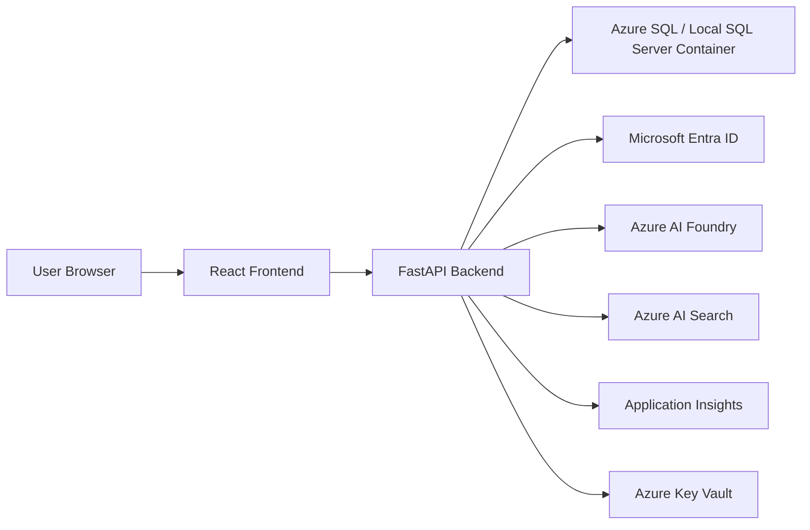

# Architecture Notes

## Target Architecture

The target application is a small authenticated community board with AI features.

## Local Development Direction

Early local development should use:

- React development server
- FastAPI development server
- SQL Server in Docker Compose

The database should not be installed as an always-running local service. Docker Compose should make service lifecycle visible and reversible.

## Deployment Direction

Initial Azure deployment should favor understandable services:

- Azure App Service for frontend/backend
- Azure SQL for the database
- App settings for early configuration
- Key Vault and managed identity in a later phase

AKS should come late, after the app already works. The Kubernetes phase is for understanding deployment concepts, not redesigning the application.

## React and Next.js Direction

Start with plain React using Vite. This keeps browser rendering, API calls, components, state, and routing easier to see.

After the React phase, a later optional phase can compare or introduce Next.js. That phase should explain what a React framework adds, such as routing conventions, server rendering, API routes, and deployment patterns.

## Python Tooling Direction

Start from familiar Python packaging concepts: virtual environments, `pip`, dependency files, and Docker images.

`uv` is worth knowing as a modern Python packaging and workflow tool, but it should be introduced as an optional improvement after the basic FastAPI workflow is understood.

