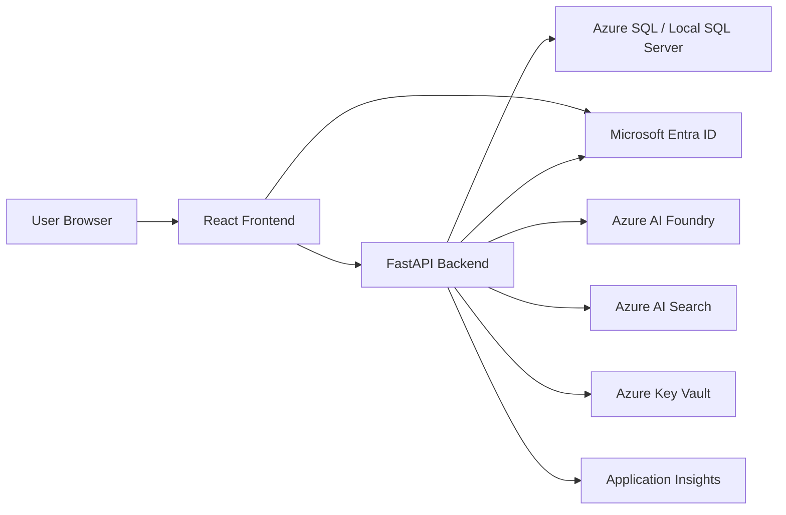

# Azure AI Community Board Plan

## Goal

Build a small Azure-hosted community board that demonstrates modern full-stack and AI application development.

The application stays intentionally small. The learning goal is to understand and explain the stack:

- React frontend
- FastAPI backend
- SQL Server locally and Azure SQL in the cloud
- Docker and Docker Compose
- Microsoft Entra ID authentication
- Authorization with roles
- Azure App Service deployment
- Azure Key Vault and managed identity
- Azure AI Foundry integration
- Basic RAG
- Application Insights monitoring
- Later AKS deployment concepts

## Target Architecture

## Application Scope

The app is a tiny authenticated community board.

Users can:

- sign in with Microsoft Entra ID
- view a feed
- create posts
- comment on posts
- use small AI actions on posts

Admins can:

- view basic app metrics
- access admin-only routes or screens

Future AI features:

- generate a short suggested comment
- summarize a discussion
- analyze an author's previous activity with a small RAG flow

## Phase Roadmap

See [README.md](../README.md) for the current phase and [scripts/README.md](../scripts/README.md) for local setup commands.

### Phase 03 - Frontend Write Flows

Goal: make the read-only frontend interactive without adding real authentication yet.

Build:

- seeded-user selector as a development stand-in for login
- create-post form
- create-comment form
- validation and API error display
- refresh or local state update after successful writes

Learn:

- React forms
- controlled inputs
- POST requests
- API validation errors
- frontend state update choices

Deliverable:

- A user can create posts and comments through the React UI using existing backend endpoints.

### Phase 04 - Auth Concepts Spike

Goal: understand the authentication model before implementing it.

Learn:

- OAuth 2.0 versus OpenID Connect
- ID tokens versus access tokens
- authorization code flow with PKCE
- frontend responsibility versus backend responsibility
- how Microsoft Entra ID fits into the app
- what claims the backend should trust

Build:

- short auth design note
- proposed local and cloud auth flow diagrams
- list of required Entra app registration settings

Deliverable:

- A documented plan for real Entra authentication.

### Phase 05 - Microsoft Entra Authentication

Goal: add real sign-in.

Build:

- frontend login/logout with Microsoft Entra ID
- backend access-token validation
- current-user endpoint
- database user mapping from Entra claims
- replacement of the seeded-user selector

Learn:

- OIDC login flow
- access token validation
- JWKS/signing keys
- claims mapping
- local development auth configuration

Deliverable:

- Users can sign in with Microsoft Entra ID and create content as themselves.

### Phase 06 - Authorization

Goal: protect actions and screens by role.

Build:

- user/admin roles
- backend authorization checks
- frontend conditional navigation
- simple admin metrics screen

Learn:

- authentication versus authorization
- role checks
- claims and database roles
- API protection even when UI hides controls

Deliverable:

- Admin-only functionality is hidden in the UI and enforced by the backend.

### Phase 07 - Azure Deployment Baseline

Goal: deploy the working app without adding extra cloud complexity yet.

Build:

- Azure resource group
- Azure SQL database
- App Service deployment for backend
- App Service or Static Web App-style hosting decision for frontend
- production app settings

Learn:

- Azure resource lifecycle
- local SQL Server versus Azure SQL
- App Service configuration
- networking basics
- cost and cleanup

Deliverable:

- The application is reachable in Azure with documented cleanup steps.

### Phase 08 - Key Vault and Managed Identity

Goal: move secrets out of plain app settings where practical.

Build:

- Azure Key Vault
- managed identity for deployed services
- Key Vault references or runtime secret loading
- documented secret rotation/reset notes

Learn:

- secret management
- managed identity
- least privilege
- local versus cloud configuration

Deliverable:

- Production secrets are managed through Azure rather than committed files or ad hoc local notes.

### Phase 09 - Azure AI Foundry

Goal: add the first AI feature.

Build:

- Foundry project/model deployment
- backend AI endpoint
- frontend "Ask AI" action on a post
- simple cost/error handling

Learn:

- model deployment
- prompt construction
- API keys or managed identity path
- cost awareness
- handling AI failures

Deliverable:

- A post can trigger a short AI-generated response.

### Phase 10 - Basic RAG

Goal: teach retrieval and context injection without building a large document system.

Build:

- retrieve author profile, posts, and comments
- build a grounded prompt from retrieved records
- optionally introduce Azure AI Search if it adds learning value at this point

Learn:

- retrieval versus generation
- context windows
- grounding
- when a search service is useful versus overkill

Deliverable:

- "Analyze Author" produces a short response based on stored app data.

### Phase 11 - Monitoring

Goal: make runtime behavior visible.

Build:

- Application Insights
- request/error tracking
- AI call tracking
- basic dashboard or query notes

Learn:

- logs versus metrics versus traces
- production diagnostics
- failure visibility

Deliverable:

- Requests, errors, and AI calls are visible in Azure monitoring.

### Phase 12 - Security and Rate Limiting

Goal: review the app as a deployed system.

Build:

- basic rate limiting for write/AI endpoints
- invalid-token tests
- missing-role tests
- security notes document

Learn:

- OWASP-style review
- API abuse prevention
- HTTP 401/403/429 behavior
- why UI checks are not enough

Deliverable:

- The app has basic abuse protection and documented security tradeoffs.

### Phase 13 - AKS Migration

Goal: understand Kubernetes deployment concepts after the app already works.

Build:

- container images for frontend/backend as needed
- Kubernetes manifests or Helm basics
- AKS deployment
- service/ingress explanation

Learn:

- pods
- deployments
- services
- ingress
- why Kubernetes exists

Deliverable:

- The existing app runs on AKS without redesigning the product.

## Success Criteria

By the end, I should be able to explain:

- how React calls a backend API
- how FastAPI routes connect to database code
- how Docker Compose services communicate
- how local SQL Server maps to Azure SQL
- how OAuth/OIDC and Entra ID authentication work
- how access tokens are validated by a backend
- how roles are enforced
- how Azure App Service hosts the app
- how Key Vault and managed identity reduce secret risk
- how Azure AI Foundry is called safely
- how basic RAG differs from a plain AI prompt
- how monitoring helps diagnose production issues
- why AKS changes deployment mechanics without changing the app's core behavior
